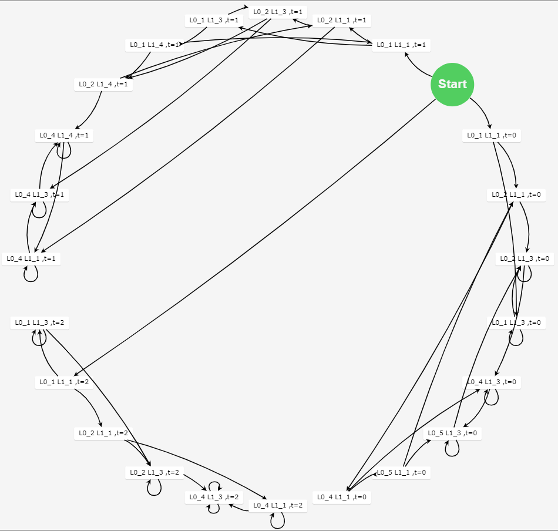

# IMP程序转KripkeStructure

## 1 可执行程序
- 可执行程序路径：./x64/Release/IMP_KS.exe
- 执行命令如下：
```shell
IMP_KS.exe ./testcase/testcase5.imp
```
- IMP_KS.exe需传入1个参数，即IMP程序文件路径。
- Windows下可通过双击.\x64\Release\test_run.bat运行测试用例。

## 2 编译环境
- Visual Studio 2017及以上版本
- 安装指导：http://c.biancheng.net/view/456.html

## 3 测试用例
### 3.1 IMP程序
```cpp
(cobegin P0||P1 coend;
P0::
t=0;
while true do
    wait(t==0);
    t=1; 
endwhile;

P1::
while true do
    wait(t==1);
    t=0; 
endwhile;)
```

### 3.2 KripkeStructure图



### 3.3 终端输出
```
D:\MyProject\IMP_KS\x64\Release>IMP_KS.exe ./testcase/testcase5.imp
Start IMPtoKS

第零步：原始IMP程序
(cobegin P0||P1 coend;P0::t=0;while true do    wait(t==0);    t=1; endwhile;P1::while true do    wait(t==1);    t=0; endwhile;)

第一步：词法分析
P0P1t=0;while true do    wait(t==0);    t=1; endwhile;
while true do    wait(t==1);    t=0; endwhile;

第二步：打标签
输出打标签的函数：
P1:
L0_1:t=0;
L0_2: while true do
L0_4:     wait (t==0);
L0_5:    t=1;
endwhile;
L0E

P1:
L1_1: while true do
L1_3:     wait (t==1);
L1_4:    t=0;
endwhile;
L1E


第三步：一阶逻辑公式
First order logical formula:
pc=l ∧ pc'= ⊥ ∧ pc'0=L0_m ∧ pc'1=L1_m
pc0=L0_1 ∧ pc0'=L0_2 ∧ (t=0) ∧ SAME(V\{t}) ∧ SAME(PC{pc0})
pc0=L0_2 ∧ pc0'=L0_4 ∧ (true) ∧ SAME(V) ∧ SAME(PC{pc0})
pc0=L0_4 ∧ pc0'=L0_4 ∧ (not t==0) ∧ SAME(V) ∧ SAME(PC{pc0})
pc0=L0_4 ∧ pc0'=L0_5 ∧ ( t==0) ∧ SAME(V) ∧ SAME(PC{pc0})
pc0=L0_5 ∧ pc0'=L0_2 ∧ (t=1) ∧ SAME(V\{t}) ∧ SAME(PC{pc0})
pc0=L0_2 ∧ pc0'=L0E ∧ (not true) ∧ SAME(V) ∧ SAME(PC{pc0})
pc1=L1_1 ∧ pc1'=L1_3 ∧ (true) ∧ SAME(V) ∧ SAME(PC{pc1})
pc1=L1_3 ∧ pc1'=L1_3 ∧ (not t==1) ∧ SAME(V) ∧ SAME(PC{pc1})
pc1=L1_3 ∧ pc1'=L1_4 ∧ ( t==1) ∧ SAME(V) ∧ SAME(PC{pc1})
pc1=L1_4 ∧ pc1'=L1_1 ∧ (t=0) ∧ SAME(V\{t}) ∧ SAME(PC{pc1})
pc1=L1_1 ∧ pc1'=L1E ∧ (not true) ∧ SAME(V) ∧ SAME(PC{pc1})
pc=⊥ ∧ pc'=l' ∧ pc0=L0E ∧ pc0'=⊥ ∧ pc1=L1E ∧ pc1'=⊥


第四步：创建Kripke Structure

第五步：生成绘图json数据
24--------49
var nodeDataArray =
[{"id":0,"text":"null null ,","category":"Start"}
,{"id":1,"text":"L0_1 L1_1 ,t=0 "}
,{"id":2,"text":"L0_2 L1_1 ,t=0 "}
,{"id":3,"text":"L0_1 L1_3 ,t=0 "}
,{"id":4,"text":"L0_4 L1_1 ,t=0 "}
,{"id":5,"text":"L0_2 L1_3 ,t=0 "}
,{"id":6,"text":"L0_5 L1_1 ,t=0 "}
,{"id":7,"text":"L0_4 L1_3 ,t=0 "}
,{"id":8,"text":"L0_5 L1_3 ,t=0 "}
,{"id":9,"text":"L0_1 L1_1 ,t=1 "}
,{"id":10,"text":"L0_2 L1_1 ,t=1 "}
,{"id":11,"text":"L0_1 L1_3 ,t=1 "}
,{"id":12,"text":"L0_4 L1_1 ,t=1 "}
,{"id":13,"text":"L0_2 L1_3 ,t=1 "}
,{"id":14,"text":"L0_1 L1_4 ,t=1 "}
,{"id":15,"text":"L0_4 L1_3 ,t=1 "}
,{"id":16,"text":"L0_2 L1_4 ,t=1 "}
,{"id":17,"text":"L0_4 L1_4 ,t=1 "}
,{"id":18,"text":"L0_1 L1_1 ,t=2 "}
,{"id":19,"text":"L0_2 L1_1 ,t=2 "}
,{"id":20,"text":"L0_1 L1_3 ,t=2 "}
,{"id":21,"text":"L0_4 L1_1 ,t=2 "}
,{"id":22,"text":"L0_2 L1_3 ,t=2 "}
,{"id":23,"text":"L0_4 L1_3 ,t=2 "}
]
var linkDataArray =
[{"from":0,"to":1}
,{"from":1,"to":2}
,{"from":1,"to":3}
,{"from":2,"to":4}
,{"from":2,"to":5}
,{"from":3,"to":5}
,{"from":3,"to":3}
,{"from":4,"to":6}
,{"from":4,"to":7}
,{"from":5,"to":7}
,{"from":5,"to":5}
,{"from":6,"to":2}
,{"from":6,"to":8}
,{"from":7,"to":8}
,{"from":7,"to":7}
,{"from":8,"to":5}
,{"from":8,"to":8}
,{"from":0,"to":9}
,{"from":9,"to":10}
,{"from":9,"to":11}
,{"from":10,"to":12}
,{"from":10,"to":13}
,{"from":11,"to":13}
,{"from":11,"to":14}
,{"from":12,"to":12}
,{"from":12,"to":15}
,{"from":13,"to":15}
,{"from":13,"to":16}
,{"from":14,"to":16}
,{"from":14,"to":9}
,{"from":15,"to":15}
,{"from":15,"to":17}
,{"from":16,"to":17}
,{"from":16,"to":10}
,{"from":17,"to":17}
,{"from":17,"to":12}
,{"from":0,"to":18}
,{"from":18,"to":19}
,{"from":18,"to":20}
,{"from":19,"to":21}
,{"from":19,"to":22}
,{"from":20,"to":22}
,{"from":20,"to":20}
,{"from":21,"to":21}
,{"from":21,"to":23}
,{"from":22,"to":23}
,{"from":22,"to":22}
,{"from":23,"to":23}
,{"from":23,"to":23}
]

第六步：浏览器自动打开显示状态图

D:\MyProject\IMP_KS\x64\Release>pause
请按任意键继续. . .
```