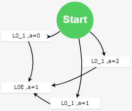
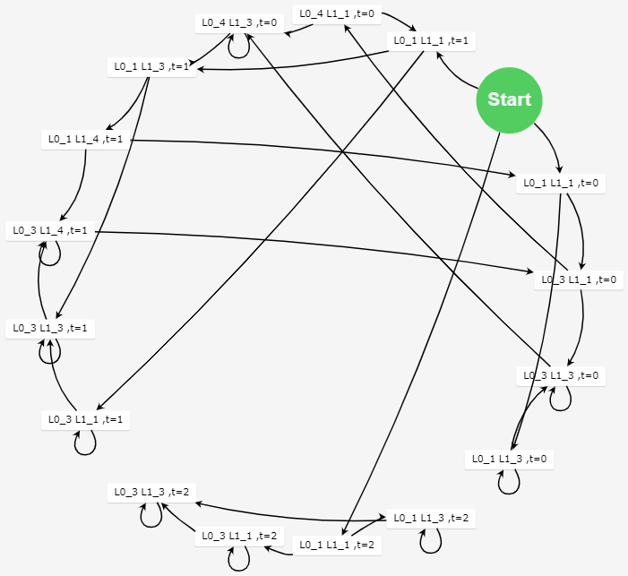
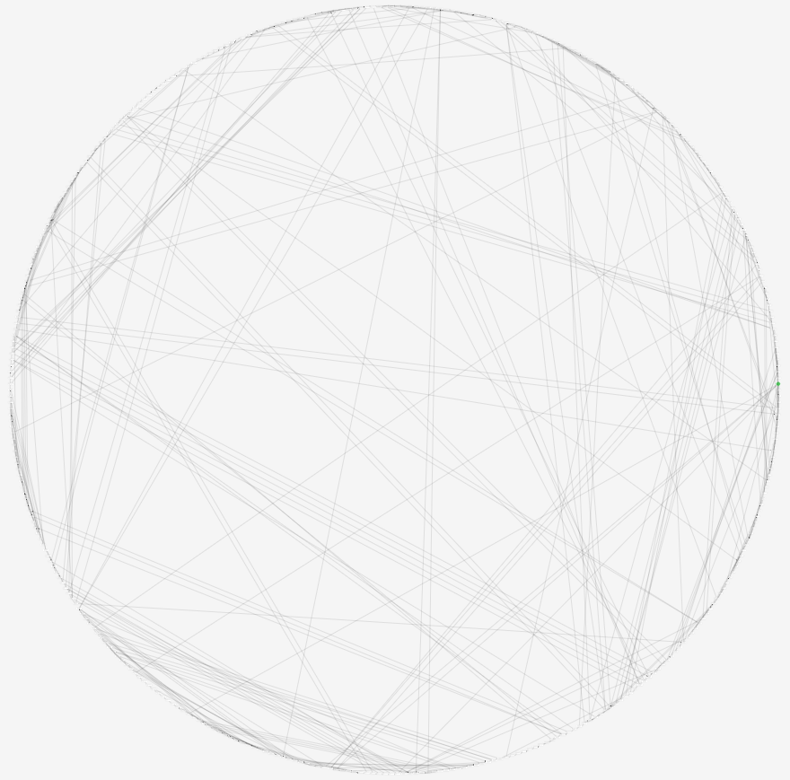

# IMP程序转KripkeStructure

- [IMP程序转KripkeStructure](#imp程序转kripkestructure)
  - [1 可执行程序](#1-可执行程序)
  - [2 编译环境](#2-编译环境)
  - [3 测试用例（同步程序）](#3-测试用例同步程序)
    - [3.1 IMP程序](#31-imp程序)
    - [3.2 KripkeStructure图](#32-kripkestructure图)
    - [3.3 终端输出](#33-终端输出)
  - [4 测试用例（异步程序）](#4-测试用例异步程序)
    - [4.1 IMP程序](#41-imp程序)
    - [4.2 KripkeStructure图](#42-kripkestructure图)
    - [4.3 终端输出](#43-终端输出)
  - [5 测试用例（复杂异步程序）](#5-测试用例复杂异步程序)
    - [5.1 IMP程序](#51-imp程序)
    - [5.2 KripkeStructure图](#52-kripkestructure图)
    - [5.3 终端输出](#53-终端输出)


## 1 可执行程序
- 可执行程序路径：./x64/Release/IMP_KS.exe
- 执行命令如下：
```shell
IMP_KS.exe ./testcase/testcase5.imp
```
- IMP_KS.exe需传入1个参数，即IMP程序文件路径。
- Windows下可通过双击.\x64\Release\test_run.bat运行测试用例。

## 2 编译环境
- Visual Studio 2017及以上版本
- 安装指导：http://c.biancheng.net/view/456.html

## 3 测试用例（同步程序）
### 3.1 IMP程序
```cpp
a=1;
```

### 3.2 KripkeStructure图



### 3.3 终端输出
```
D:\GitHub\IMP_KS\x64\Release>IMP_KS.exe ./testcase/testcase1.imp
Start IMPtoKS

第零步：原始IMP程序
a=1;

第一步：词法分析
a=1;

第二步：打标签
输出打标签的函数：
P1:
L0_1:a=1;
L0E


第三步：一阶逻辑公式
pc=L0_m ∧ pc'=L0_1
pc=L0_1 ∧ pc'=L0E ∧ (a=1) ∧ SAME(V\{a})


第四步：创建Kripke Structure(json数据)
var nodeDataArray =
[{"id":0,"text":"null ,","category":"Start"}
,{"id":1,"text":"L0_1 ,a=0 "}
,{"id":2,"text":"L0E ,a=1 "}
,{"id":3,"text":"L0_1 ,a=1 "}
,{"id":4,"text":"L0_1 ,a=2 "}
]
var linkDataArray =
[{"from":0,"to":1}
,{"from":1,"to":2}
,{"from":0,"to":3}
,{"from":3,"to":2}
,{"from":0,"to":4}
,{"from":4,"to":2}
]

第五步：浏览器自动打开显示状态图

D:\GitHub\IMP_KS\x64\Release>pause
请按任意键继续. . .
```

## 4 测试用例（异步程序）
### 4.1 IMP程序
```cpp
(cobegin P0||P1 coend;
P0::
t=0;
while true do
    wait(t==0);
    t=1; 
endwhile;

P1::
while true do
    wait(t==1);
    t=0; 
endwhile;)
```

### 4.2 KripkeStructure图



### 4.3 终端输出
```
D:\MyProject\IMP_KS\x64\Release>IMP_KS.exe ./testcase/testcase5.imp
Start IMPtoKS

第零步：原始IMP程序
(cobegin P0||P1 coend;P0::t=0;while true do    wait(t==0);    t=1; endwhile;P1::while true do    wait(t==1);    t=0; endwhile;)

第一步：词法分析
P0P1t=0;while true do    wait(t==0);    t=1; endwhile;
while true do    wait(t==1);    t=0; endwhile;

第二步：打标签
输出打标签的函数：
P1:
L0_1: while true do
L0_3:     wait (t==0);
L0_4:    t=1;
endwhile;
L0E

P1:
L1_1: while true do
L1_3:     wait (t==1);
L1_4:    t=0;
endwhile;
L1E


第三步：一阶逻辑公式
pc=l ∧ pc'= ⊥ ∧ pc'0=L0_m ∧ pc'1=L1_m
pc0=L0_1 ∧ pc0'=L0_3 ∧ (true) ∧ SAME(V) ∧ SAME(PC{pc0})
pc0=L0_3 ∧ pc0'=L0_3 ∧ (not t==0) ∧ SAME(V) ∧ SAME(PC{pc0})
pc0=L0_3 ∧ pc0'=L0_4 ∧ ( t==0) ∧ SAME(V) ∧ SAME(PC{pc0})
pc0=L0_4 ∧ pc0'=L0_1 ∧ (t=1) ∧ SAME(V\{t}) ∧ SAME(PC{pc0})
pc0=L0_1 ∧ pc0'=L0E ∧ (not true) ∧ SAME(V) ∧ SAME(PC{pc0})
pc1=L1_1 ∧ pc1'=L1_3 ∧ (true) ∧ SAME(V) ∧ SAME(PC{pc1})
pc1=L1_3 ∧ pc1'=L1_3 ∧ (not t==1) ∧ SAME(V) ∧ SAME(PC{pc1})
pc1=L1_3 ∧ pc1'=L1_4 ∧ ( t==1) ∧ SAME(V) ∧ SAME(PC{pc1})
pc1=L1_4 ∧ pc1'=L1_1 ∧ (t=0) ∧ SAME(V\{t}) ∧ SAME(PC{pc1})
pc1=L1_1 ∧ pc1'=L1E ∧ (not true) ∧ SAME(V) ∧ SAME(PC{pc1})
pc=⊥ ∧ pc'=l' ∧ pc0=L0E ∧ pc0'=⊥ ∧ pc1=L1E ∧ pc1'=⊥


第四步：创建Kripke Structure(json数据)
var nodeDataArray =
[{"id":0,"text":"null null ,","category":"Start"}
,{"id":1,"text":"L0_1 L1_1 ,t=0 "}
,{"id":2,"text":"L0_3 L1_1 ,t=0 "}
,{"id":3,"text":"L0_1 L1_3 ,t=0 "}
,{"id":4,"text":"L0_4 L1_1 ,t=0 "}
,{"id":5,"text":"L0_3 L1_3 ,t=0 "}
,{"id":6,"text":"L0_1 L1_1 ,t=1 "}
,{"id":7,"text":"L0_4 L1_3 ,t=0 "}
,{"id":8,"text":"L0_3 L1_1 ,t=1 "}
,{"id":9,"text":"L0_1 L1_3 ,t=1 "}
,{"id":10,"text":"L0_3 L1_3 ,t=1 "}
,{"id":11,"text":"L0_1 L1_4 ,t=1 "}
,{"id":12,"text":"L0_3 L1_4 ,t=1 "}
,{"id":13,"text":"L0_1 L1_1 ,t=2 "}
,{"id":14,"text":"L0_3 L1_1 ,t=2 "}
,{"id":15,"text":"L0_1 L1_3 ,t=2 "}
,{"id":16,"text":"L0_3 L1_3 ,t=2 "}
]
var linkDataArray =
[{"from":0,"to":1}
,{"from":1,"to":2}
,{"from":1,"to":3}
,{"from":2,"to":4}
,{"from":2,"to":5}
,{"from":3,"to":5}
,{"from":3,"to":3}
,{"from":4,"to":6}
,{"from":4,"to":7}
,{"from":5,"to":7}
,{"from":5,"to":5}
,{"from":6,"to":8}
,{"from":6,"to":9}
,{"from":7,"to":9}
,{"from":7,"to":7}
,{"from":8,"to":8}
,{"from":8,"to":10}
,{"from":9,"to":10}
,{"from":9,"to":11}
,{"from":10,"to":10}
,{"from":10,"to":12}
,{"from":11,"to":12}
,{"from":11,"to":1}
,{"from":12,"to":12}
,{"from":12,"to":2}
,{"from":0,"to":6}
,{"from":0,"to":13}
,{"from":13,"to":14}
,{"from":13,"to":15}
,{"from":14,"to":14}
,{"from":14,"to":16}
,{"from":15,"to":16}
,{"from":15,"to":15}
,{"from":16,"to":16}
]

第五步：浏览器自动打开显示状态图

D:\MyProject\IMP_KS\x64\Release>pause
请按任意键继续. . .
```

## 5 测试用例（复杂异步程序）
### 5.1 IMP程序
```cpp
(cobegin P0||P1 coend;
P0::
if x<2 then
while x<2 do
while y<2 do
    if x<y then 
        x=x+1; 
    else 
        y=y+1;
    endif;
endwhile;
x=x+1;
endwhile;
else
while y<2 do
if x<y then
    while x<2 do
        x=x+1;
    endwhile;
else 
    y=y+1;
endif;
y=y+1;
endwhile;
endif;

P1::
while y<2 do
if x<y then
    while x<2 do
        x=x+1;
    endwhile;
else 
    y=y+1;
endif;
y=y+1;
endwhile;)
```

### 5.2 KripkeStructure图



### 5.3 终端输出
```
D:\MyProject\IMP_KS\x64\Release>IMP_KS.exe ./testcase/testcase6.imp
Start IMPtoKS

第零步：原始IMP程序
(cobegin P0||P1 coend;P0::if x<2 thenwhile x<2 dowhile y<2 do    if x<y then         x=x+1;     else         y=y+1;    endif;endwhile;x=x+1;endwhile;elsewhile y<2 doif x<y then    while x<2 do        x=x+1;    endwhile;else     y=y+1;endif;y=y+1;endwhile;endif;P1::while y<2 doif x<y then    while x<2 do        x=x+1;    endwhile;else     y=y+1;endif;y=y+1;endwhile;)

第一步：词法分析
P0P1if x<2 thenwhile x<2 dowhile y<2 do    if x<y then         x=x+1;     else         y=y+1;    endif;endwhile;x=x+1;endwhile;elsewhile y<2 doif x<y then    while x<2 do        x=x+1;    endwhile;else     y=y+1;endif;y=y+1;endwhile;endif;
while y<2 doif x<y then    while x<2 do        x=x+1;    endwhile;else     y=y+1;endif;y=y+1;endwhile;

第二步：打标签
输出打标签的函数：
P1:
L0_1: if x<2 then
L0_3:   while x<2 do
L0_5:       while y<2 do
L0_7: if x<y then
L0_9:            x=x+1;
               else
L0_11:            y=y+1;
               endif
endwhile;
L0_12:      x=x+1;
endwhile;
     else
L0_14:   while y<2 do
L0_16: if x<y then
L0_18:         while x<2 do
L0_20:            x=x+1;
endwhile;
           else
L0_22:        y=y+1;
           endif
L0_23:      y=y+1;
endwhile;
     endif
L0E

P1:
L1_1: while y<2 do
L1_3: if x<y then
L1_5:       while x<2 do
L1_7:          x=x+1;
endwhile;
         else
L1_9:      y=y+1;
         endif
L1_10:    y=y+1;
endwhile;
L1E


第三步：一阶逻辑公式
pc=l ∧ pc'= ⊥ ∧ pc'0=L0_m ∧ pc'1=L1_m
pc0=L0_1 ∧ pc0'=L0_3 ∧ (x<2) ∧ SAME(V) ∧ SAME(PC{pc0})
pc0=L0_3 ∧ pc0'=L0_5 ∧ (x<2) ∧ SAME(V) ∧ SAME(PC{pc0})
pc0=L0_5 ∧ pc0'=L0_7 ∧ (y<2) ∧ SAME(V) ∧ SAME(PC{pc0})
pc0=L0_7 ∧ pc0'=L0_9 ∧ (x<y) ∧ SAME(V) ∧ SAME(PC{pc0})
pc0=L0_9 ∧ pc0'=L0_5 ∧ (x=x+1) ∧ SAME(V\{x}) ∧ SAME(PC{pc0})
pc0=L0_7 ∧ pc0'=L0_11 ∧ (not x<y) ∧ SAME(V) ∧ SAME(PC{pc0})
pc0=L0_11 ∧ pc0'=L0_5 ∧ (y=y+1) ∧ SAME(V\{y}) ∧ SAME(PC{pc0})
pc0=L0_5 ∧ pc0'=L0_12 ∧ (not y<2) ∧ SAME(V) ∧ SAME(PC{pc0})
pc0=L0_12 ∧ pc0'=L0_3 ∧ (x=x+1) ∧ SAME(V\{x}) ∧ SAME(PC{pc0})
pc0=L0_3 ∧ pc0'=L0E ∧ (not x<2) ∧ SAME(V) ∧ SAME(PC{pc0})
pc0=L0_1 ∧ pc0'=L0_14 ∧ (not x<2) ∧ SAME(V) ∧ SAME(PC{pc0})
pc0=L0_14 ∧ pc0'=L0_16 ∧ (y<2) ∧ SAME(V) ∧ SAME(PC{pc0})
pc0=L0_16 ∧ pc0'=L0_18 ∧ (x<y) ∧ SAME(V) ∧ SAME(PC{pc0})
pc0=L0_18 ∧ pc0'=L0_20 ∧ (x<2) ∧ SAME(V) ∧ SAME(PC{pc0})
pc0=L0_20 ∧ pc0'=L0_18 ∧ (x=x+1) ∧ SAME(V\{x}) ∧ SAME(PC{pc0})
pc0=L0_18 ∧ pc0'=L0_23 ∧ (not x<2) ∧ SAME(V) ∧ SAME(PC{pc0})
pc0=L0_16 ∧ pc0'=L0_22 ∧ (not x<y) ∧ SAME(V) ∧ SAME(PC{pc0})
pc0=L0_22 ∧ pc0'=L0_23 ∧ (y=y+1) ∧ SAME(V\{y}) ∧ SAME(PC{pc0})
pc0=L0_23 ∧ pc0'=L0_14 ∧ (y=y+1) ∧ SAME(V\{y}) ∧ SAME(PC{pc0})
pc0=L0_14 ∧ pc0'=L0E ∧ (not y<2) ∧ SAME(V) ∧ SAME(PC{pc0})
pc1=L1_1 ∧ pc1'=L1_3 ∧ (y<2) ∧ SAME(V) ∧ SAME(PC{pc1})
pc1=L1_3 ∧ pc1'=L1_5 ∧ (x<y) ∧ SAME(V) ∧ SAME(PC{pc1})
pc1=L1_5 ∧ pc1'=L1_7 ∧ (x<2) ∧ SAME(V) ∧ SAME(PC{pc1})
pc1=L1_7 ∧ pc1'=L1_5 ∧ (x=x+1) ∧ SAME(V\{x}) ∧ SAME(PC{pc1})
pc1=L1_5 ∧ pc1'=L1_10 ∧ (not x<2) ∧ SAME(V) ∧ SAME(PC{pc1})
pc1=L1_3 ∧ pc1'=L1_9 ∧ (not x<y) ∧ SAME(V) ∧ SAME(PC{pc1})
pc1=L1_9 ∧ pc1'=L1_10 ∧ (y=y+1) ∧ SAME(V\{y}) ∧ SAME(PC{pc1})
pc1=L1_10 ∧ pc1'=L1_1 ∧ (y=y+1) ∧ SAME(V\{y}) ∧ SAME(PC{pc1})
pc1=L1_1 ∧ pc1'=L1E ∧ (not y<2) ∧ SAME(V) ∧ SAME(PC{pc1})
pc=⊥ ∧ pc'=l' ∧ pc0=L0E ∧ pc0'=⊥ ∧ pc1=L1E ∧ pc1'=⊥


第四步：创建Kripke Structure(json数据)
var nodeDataArray =
[{"id":0,"text":"null null ,","category":"Start"}
,{"id":1,"text":"L0_1 L1_1 ,x=0 y=0 "}
,{"id":2,"text":"L0_3 L1_1 ,x=0 y=0 "}
,{"id":3,"text":"L0_1 L1_3 ,x=0 y=0 "}
,{"id":4,"text":"L0_5 L1_1 ,x=0 y=0 "}
,{"id":5,"text":"L0_3 L1_3 ,x=0 y=0 "}
,{"id":6,"text":"L0_1 L1_9 ,x=0 y=0 "}
,{"id":7,"text":"L0_7 L1_1 ,x=0 y=0 "}
,{"id":8,"text":"L0_5 L1_3 ,x=0 y=0 "}
,{"id":9,"text":"L0_3 L1_9 ,x=0 y=0 "}
,{"id":10,"text":"L0_1 L1_10 ,x=0 y=1 "}
,{"id":11,"text":"L0_11 L1_1 ,x=0 y=0 "}
,{"id":12,"text":"L0_7 L1_3 ,x=0 y=0 "}
,{"id":13,"text":"L0_5 L1_9 ,x=0 y=0 "}
,{"id":14,"text":"L0_3 L1_10 ,x=0 y=1 "}
,{"id":15,"text":"L0_1 L1_1 ,x=0 y=2 "}
,{"id":16,"text":"L0_5 L1_1 ,x=0 y=1 "}
,{"id":17,"text":"L0_11 L1_3 ,x=0 y=0 "}
,{"id":18,"text":"L0_7 L1_9 ,x=0 y=0 "}
,{"id":19,"text":"L0_5 L1_10 ,x=0 y=1 "}
,{"id":20,"text":"L0_3 L1_1 ,x=0 y=2 "}
,{"id":21,"text":"L0_1 L1E ,x=0 y=2 "}
,{"id":22,"text":"L0_7 L1_1 ,x=0 y=1 "}
,{"id":23,"text":"L0_5 L1_3 ,x=0 y=1 "}
,{"id":24,"text":"L0_11 L1_9 ,x=0 y=0 "}
,{"id":25,"text":"L0_7 L1_10 ,x=0 y=1 "}
,{"id":26,"text":"L0_5 L1_1 ,x=0 y=2 "}
,{"id":27,"text":"L0_3 L1E ,x=0 y=2 "}
,{"id":28,"text":"L0_9 L1_1 ,x=0 y=1 "}
,{"id":29,"text":"L0_7 L1_3 ,x=0 y=1 "}
,{"id":30,"text":"L0_5 L1_5 ,x=0 y=1 "}
,{"id":31,"text":"L0_5 L1_9 ,x=0 y=1 "}
,{"id":32,"text":"L0_11 L1_10 ,x=0 y=1 "}
,{"id":33,"text":"L0_9 L1_10 ,x=0 y=1 "}
,{"id":34,"text":"L0_7 L1_1 ,x=0 y=2 "}
,{"id":35,"text":"L0_12 L1_1 ,x=0 y=2 "}
,{"id":36,"text":"L0_5 L1E ,x=0 y=2 "}
,{"id":37,"text":"L0_5 L1_1 ,x=1 y=1 "}
,{"id":38,"text":"L0_9 L1_3 ,x=0 y=1 "}
,{"id":39,"text":"L0_7 L1_5 ,x=0 y=1 "}
,{"id":40,"text":"L0_5 L1_7 ,x=0 y=1 "}
,{"id":41,"text":"L0_7 L1_9 ,x=0 y=1 "}
,{"id":42,"text":"L0_5 L1_10 ,x=0 y=2 "}
,{"id":43,"text":"L0_11 L1_1 ,x=0 y=2 "}
,{"id":44,"text":"L0_5 L1_10 ,x=1 y=1 "}
,{"id":45,"text":"L0_9 L1_1 ,x=0 y=2 "}
,{"id":46,"text":"L0_7 L1E ,x=0 y=2 "}
,{"id":47,"text":"L0_3 L1_1 ,x=1 y=2 "}
,{"id":48,"text":"L0_12 L1E ,x=0 y=2 "}
,{"id":49,"text":"L0_7 L1_1 ,x=1 y=1 "}
,{"id":50,"text":"L0_5 L1_3 ,x=1 y=1 "}
,{"id":51,"text":"L0_9 L1_5 ,x=0 y=1 "}
,{"id":52,"text":"L0_7 L1_7 ,x=0 y=1 "}
,{"id":53,"text":"L0_5 L1_5 ,x=1 y=1 "}
,{"id":54,"text":"L0_9 L1_9 ,x=0 y=1 "}
,{"id":55,"text":"L0_7 L1_10 ,x=0 y=2 "}
,{"id":56,"text":"L0_12 L1_10 ,x=0 y=2 "}
,{"id":57,"text":"L0_11 L1E ,x=0 y=2 "}
,{"id":58,"text":"L0_7 L1_10 ,x=1 y=1 "}
,{"id":59,"text":"L0_5 L1_1 ,x=1 y=2 "}
,{"id":60,"text":"L0_9 L1E ,x=0 y=2 "}
,{"id":61,"text":"L0_3 L1E ,x=1 y=2 "}
,{"id":62,"text":"L0_11 L1_1 ,x=1 y=1 "}
,{"id":63,"text":"L0_7 L1_3 ,x=1 y=1 "}
,{"id":64,"text":"L0_5 L1_9 ,x=1 y=1 "}
,{"id":65,"text":"L0_9 L1_7 ,x=0 y=1 "}
,{"id":66,"text":"L0_7 L1_5 ,x=1 y=1 "}
,{"id":67,"text":"L0_5 L1_7 ,x=1 y=1 "}
,{"id":68,"text":"L0_9 L1_10 ,x=0 y=2 "}
,{"id":69,"text":"L0_3 L1_10 ,x=1 y=2 "}
,{"id":70,"text":"L0_12 L1_1 ,x=0 y=0 "}
,{"id":71,"text":"L0_5 L1E ,x=0 y=0 "}
,{"id":72,"text":"L0_11 L1_10 ,x=1 y=1 "}
,{"id":73,"text":"L0_7 L1_1 ,x=1 y=2 "}
,{"id":74,"text":"L0_12 L1_1 ,x=1 y=2 "}
,{"id":75,"text":"L0_5 L1E ,x=1 y=2 "}
,{"id":76,"text":"L0_11 L1_3 ,x=1 y=1 "}
,{"id":77,"text":"L0_7 L1_9 ,x=1 y=1 "}
,{"id":78,"text":"L0_5 L1_10 ,x=1 y=2 "}
,{"id":79,"text":"L0_9 L1_5 ,x=1 y=1 "}
,{"id":80,"text":"L0_11 L1_5 ,x=1 y=1 "}
,{"id":81,"text":"L0_7 L1_7 ,x=1 y=1 "}
,{"id":82,"text":"L0_5 L1_5 ,x=2 y=1 "}
,{"id":83,"text":"L0_9 L1_1 ,x=0 y=0 "}
,{"id":84,"text":"L0_3 L1_1 ,x=1 y=0 "}
,{"id":85,"text":"L0_12 L1_3 ,x=0 y=0 "}
,{"id":86,"text":"L0_7 L1E ,x=0 y=0 "}
,{"id":87,"text":"L0_11 L1_1 ,x=1 y=2 "}
,{"id":88,"text":"L0_9 L1_1 ,x=1 y=2 "}
,{"id":89,"text":"L0_7 L1E ,x=1 y=2 "}
,{"id":90,"text":"L0_3 L1_1 ,x=2 y=2 "}
,{"id":91,"text":"L0_12 L1E ,x=1 y=2 "}
,{"id":92,"text":"L0_5 L1_3 ,x=1 y=2 "}
,{"id":93,"text":"L0_11 L1_9 ,x=1 y=1 "}
,{"id":94,"text":"L0_7 L1_10 ,x=1 y=2 "}
,{"id":95,"text":"L0_12 L1_10 ,x=1 y=2 "}
,{"id":96,"text":"L0_5 L1_1 ,x=1 y=0 "}
,{"id":97,"text":"L0_9 L1_7 ,x=1 y=1 "}
,{"id":98,"text":"L0_5 L1_5 ,x=1 y=2 "}
,{"id":99,"text":"L0_11 L1_7 ,x=1 y=1 "}
,{"id":100,"text":"L0_7 L1_5 ,x=2 y=1 "}
,{"id":101,"text":"L0_5 L1_10 ,x=2 y=1 "}
,{"id":102,"text":"L0_9 L1_3 ,x=0 y=0 "}
,{"id":103,"text":"L0_3 L1_3 ,x=1 y=0 "}
,{"id":104,"text":"L0_12 L1_9 ,x=0 y=0 "}
,{"id":105,"text":"L0_11 L1E ,x=0 y=0 "}
,{"id":106,"text":"L0_11 L1E ,x=1 y=2 "}
,{"id":107,"text":"L0_5 L1_1 ,x=2 y=2 "}
,{"id":108,"text":"L0_9 L1E ,x=1 y=2 "}
,{"id":109,"text":"L0E L1_1 ,x=2 y=2 "}
,{"id":110,"text":"L0_3 L1E ,x=2 y=2 "}
,{"id":111,"text":"L0_12 L1_3 ,x=1 y=2 "}
,{"id":112,"text":"L0_5 L1_9 ,x=1 y=2 "}
,{"id":113,"text":"L0_11 L1_10 ,x=1 y=2 "}
,{"id":114,"text":"L0_9 L1_10 ,x=1 y=2 "}
,{"id":115,"text":"L0_7 L1_1 ,x=1 y=0 "}
,{"id":116,"text":"L0_3 L1_10 ,x=2 y=2 "}
,{"id":117,"text":"L0_12 L1_1 ,x=1 y=0 "}
,{"id":118,"text":"L0_5 L1_3 ,x=1 y=0 "}
,{"id":119,"text":"L0_5 L1_7 ,x=2 y=1 "}
,{"id":120,"text":"L0_9 L1_5 ,x=2 y=1 "}
,{"id":121,"text":"L0_12 L1_5 ,x=1 y=2 "}
,{"id":122,"text":"L0_5 L1_7 ,x=1 y=2 "}
,{"id":123,"text":"L0_11 L1_5 ,x=2 y=1 "}
,{"id":124,"text":"L0_7 L1_10 ,x=2 y=1 "}
,{"id":125,"text":"L0_9 L1_9 ,x=0 y=0 "}
,{"id":126,"text":"L0_3 L1_9 ,x=1 y=0 "}
,{"id":127,"text":"L0_12 L1_10 ,x=0 y=1 "}
,{"id":128,"text":"L0_5 L1E ,x=0 y=1 "}
,{"id":129,"text":"L0_5 L1E ,x=1 y=0 "}
,{"id":130,"text":"L0_12 L1_1 ,x=2 y=2 "}
,{"id":131,"text":"L0_5 L1E ,x=2 y=2 "}
,{"id":132,"text":"L0E L1E ,x=2 y=2 "}
,{"id":133,"text":"L0_3 L1_3 ,x=2 y=2 "}
,{"id":134,"text":"L0_12 L1_9 ,x=1 y=2 "}
,{"id":135,"text":"L0_5 L1_10 ,x=1 y=0 "}
,{"id":136,"text":"L0_11 L1_1 ,x=1 y=0 "}
,{"id":137,"text":"L0_5 L1_10 ,x=2 y=2 "}
,{"id":138,"text":"L0_9 L1_1 ,x=1 y=0 "}
,{"id":139,"text":"L0_7 L1_3 ,x=1 y=0 "}
,{"id":140,"text":"L0E L1_10 ,x=2 y=2 "}
,{"id":141,"text":"L0_3 L1_1 ,x=2 y=0 "}
,{"id":142,"text":"L0_12 L1_3 ,x=1 y=0 "}
,{"id":143,"text":"L0_5 L1_9 ,x=1 y=0 "}
,{"id":144,"text":"L0_7 L1_7 ,x=2 y=1 "}
,{"id":145,"text":"L0_9 L1_10 ,x=2 y=1 "}
,{"id":146,"text":"L0_3 L1_5 ,x=2 y=2 "}
,{"id":147,"text":"L0_12 L1_7 ,x=1 y=2 "}
,{"id":148,"text":"L0_5 L1_5 ,x=2 y=2 "}
,{"id":149,"text":"L0_11 L1_10 ,x=2 y=1 "}
,{"id":150,"text":"L0_7 L1_1 ,x=2 y=2 "}
,{"id":151,"text":"L0_3 L1_10 ,x=1 y=1 "}
,{"id":152,"text":"L0_7 L1E ,x=0 y=1 "}
,{"id":153,"text":"L0_7 L1E ,x=1 y=0 "}
,{"id":154,"text":"L0_12 L1E ,x=2 y=2 "}
,{"id":155,"text":"L0E L1_3 ,x=2 y=2 "}
,{"id":156,"text":"L0_3 L1_9 ,x=2 y=2 "}
,{"id":157,"text":"L0_12 L1_10 ,x=1 y=0 "}
,{"id":158,"text":"L0_7 L1_10 ,x=1 y=0 "}
,{"id":159,"text":"L0_11 L1_3 ,x=1 y=0 "}
,{"id":160,"text":"L0_12 L1_10 ,x=2 y=2 "}
,{"id":161,"text":"L0_5 L1_1 ,x=2 y=0 "}
,{"id":162,"text":"L0_9 L1_3 ,x=1 y=0 "}
,{"id":163,"text":"L0_7 L1_9 ,x=1 y=0 "}
,{"id":164,"text":"L0E L1_1 ,x=2 y=0 "}
,{"id":165,"text":"L0_3 L1_3 ,x=2 y=0 "}
,{"id":166,"text":"L0_12 L1_9 ,x=1 y=0 "}
,{"id":167,"text":"L0_11 L1_7 ,x=2 y=1 "}
,{"id":168,"text":"L0_9 L1_1 ,x=2 y=2 "}
,{"id":169,"text":"L0E L1_5 ,x=2 y=2 "}
,{"id":170,"text":"L0_3 L1_7 ,x=2 y=2 "}
,{"id":171,"text":"L0_12 L1_5 ,x=2 y=2 "}
,{"id":172,"text":"L0_11 L1_1 ,x=2 y=2 "}
,{"id":173,"text":"L0_7 L1E ,x=2 y=2 "}
,{"id":174,"text":"L0_9 L1E ,x=0 y=1 "}
,{"id":175,"text":"L0_11 L1E ,x=1 y=0 "}
,{"id":176,"text":"L0E L1_9 ,x=2 y=2 "}
,{"id":177,"text":"L0_3 L1_10 ,x=2 y=0 "}
,{"id":178,"text":"L0_12 L1_1 ,x=1 y=1 "}
,{"id":179,"text":"L0_11 L1_10 ,x=1 y=0 "}
,{"id":180,"text":"L0_11 L1_9 ,x=1 y=0 "}
,{"id":181,"text":"L0_3 L1_10 ,x=0 y=2 "}
,{"id":182,"text":"L0_12 L1_1 ,x=2 y=0 "}
,{"id":183,"text":"L0_7 L1_1 ,x=2 y=0 "}
,{"id":184,"text":"L0_5 L1_3 ,x=2 y=0 "}
,{"id":185,"text":"L0_9 L1_9 ,x=1 y=0 "}
,{"id":186,"text":"L0E L1_3 ,x=2 y=0 "}
,{"id":187,"text":"L0_3 L1_9 ,x=2 y=0 "}
,{"id":188,"text":"L0_12 L1_10 ,x=1 y=1 "}
,{"id":189,"text":"L0_5 L1_7 ,x=2 y=2 "}
,{"id":190,"text":"L0_11 L1_5 ,x=0 y=1 "}
,{"id":191,"text":"L0_9 L1E ,x=2 y=2 "}
,{"id":192,"text":"L0E L1_7 ,x=2 y=2 "}
,{"id":193,"text":"L0_3 L1_5 ,x=0 y=2 "}
,{"id":194,"text":"L0_11 L1E ,x=2 y=2 "}
,{"id":195,"text":"L0_5 L1E ,x=1 y=1 "}
,{"id":196,"text":"L0E L1_10 ,x=2 y=0 "}
,{"id":197,"text":"L0_3 L1_1 ,x=2 y=1 "}
,{"id":198,"text":"L0_12 L1_3 ,x=1 y=1 "}
,{"id":199,"text":"L0_12 L1_3 ,x=2 y=0 "}
,{"id":200,"text":"L0_11 L1_1 ,x=2 y=0 "}
,{"id":201,"text":"L0_7 L1_3 ,x=2 y=0 "}
,{"id":202,"text":"L0_5 L1_9 ,x=2 y=0 "}
,{"id":203,"text":"L0_9 L1_10 ,x=1 y=1 "}
,{"id":204,"text":"L0E L1_9 ,x=2 y=0 "}
,{"id":205,"text":"L0_3 L1_10 ,x=2 y=1 "}
,{"id":206,"text":"L0_12 L1_7 ,x=2 y=2 "}
,{"id":207,"text":"L0_5 L1_5 ,x=0 y=2 "}
,{"id":208,"text":"L0_11 L1_7 ,x=0 y=1 "}
,{"id":209,"text":"L0E L1_5 ,x=0 y=2 "}
,{"id":210,"text":"L0_3 L1_7 ,x=0 y=2 "}
,{"id":211,"text":"L0_5 L1E ,x=2 y=0 "}
,{"id":212,"text":"L0_7 L1E ,x=1 y=1 "}
,{"id":213,"text":"L0E L1_1 ,x=2 y=1 "}
,{"id":214,"text":"L0_3 L1_3 ,x=2 y=1 "}
,{"id":215,"text":"L0_12 L1_9 ,x=1 y=1 "}
,{"id":216,"text":"L0_12 L1_9 ,x=2 y=0 "}
,{"id":217,"text":"L0_5 L1_1 ,x=2 y=1 "}
,{"id":218,"text":"L0_11 L1_3 ,x=2 y=0 "}
,{"id":219,"text":"L0_7 L1_9 ,x=2 y=0 "}
,{"id":220,"text":"L0E L1_10 ,x=2 y=1 "}
,{"id":221,"text":"L0_12 L1_5 ,x=0 y=2 "}
,{"id":222,"text":"L0_5 L1_7 ,x=0 y=2 "}
,{"id":223,"text":"L0E L1_7 ,x=0 y=2 "}
,{"id":224,"text":"L0_3 L1_5 ,x=1 y=2 "}
,{"id":225,"text":"L0_7 L1E ,x=2 y=0 "}
,{"id":226,"text":"L0_11 L1E ,x=1 y=1 "}
,{"id":227,"text":"L0E L1_3 ,x=2 y=1 "}
,{"id":228,"text":"L0_3 L1_9 ,x=2 y=1 "}
,{"id":229,"text":"L0_12 L1_10 ,x=2 y=1 "}
,{"id":230,"text":"L0_7 L1_1 ,x=2 y=1 "}
,{"id":231,"text":"L0_5 L1_3 ,x=2 y=1 "}
,{"id":232,"text":"L0_11 L1_9 ,x=2 y=0 "}
,{"id":233,"text":"L0_12 L1_7 ,x=0 y=2 "}
,{"id":234,"text":"L0E L1_5 ,x=1 y=2 "}
,{"id":235,"text":"L0_3 L1_7 ,x=1 y=2 "}
,{"id":236,"text":"L0_11 L1E ,x=2 y=0 "}
,{"id":237,"text":"L0E L1_9 ,x=2 y=1 "}
,{"id":238,"text":"L0_11 L1_1 ,x=2 y=1 "}
,{"id":239,"text":"L0_7 L1_3 ,x=2 y=1 "}
,{"id":240,"text":"L0_5 L1_9 ,x=2 y=1 "}
,{"id":241,"text":"L0E L1_7 ,x=1 y=2 "}
,{"id":242,"text":"L0_5 L1E ,x=2 y=1 "}
,{"id":243,"text":"L0_11 L1_3 ,x=2 y=1 "}
,{"id":244,"text":"L0_7 L1_9 ,x=2 y=1 "}
,{"id":245,"text":"L0_7 L1E ,x=2 y=1 "}
,{"id":246,"text":"L0_5 L1_3 ,x=2 y=2 "}
,{"id":247,"text":"L0_11 L1_9 ,x=2 y=1 "}
,{"id":248,"text":"L0_7 L1_10 ,x=2 y=2 "}
,{"id":249,"text":"L0_11 L1E ,x=2 y=1 "}
,{"id":250,"text":"L0_12 L1_3 ,x=2 y=2 "}
,{"id":251,"text":"L0_5 L1_9 ,x=2 y=2 "}
,{"id":252,"text":"L0_11 L1_10 ,x=2 y=2 "}
,{"id":253,"text":"L0_3 L1_3 ,x=0 y=2 "}
,{"id":254,"text":"L0_12 L1_9 ,x=2 y=2 "}
,{"id":255,"text":"L0_5 L1_10 ,x=2 y=0 "}
,{"id":256,"text":"L0_5 L1_3 ,x=0 y=2 "}
,{"id":257,"text":"L0_3 L1_9 ,x=0 y=2 "}
,{"id":258,"text":"L0_12 L1_10 ,x=2 y=0 "}
,{"id":259,"text":"L0_7 L1_10 ,x=2 y=0 "}
,{"id":260,"text":"L0_12 L1_3 ,x=0 y=2 "}
,{"id":261,"text":"L0_5 L1_9 ,x=0 y=2 "}
,{"id":262,"text":"L0_3 L1_10 ,x=0 y=0 "}
,{"id":263,"text":"L0_12 L1_1 ,x=2 y=1 "}
,{"id":264,"text":"L0_11 L1_10 ,x=2 y=0 "}
,{"id":265,"text":"L0_3 L1_3 ,x=1 y=2 "}
,{"id":266,"text":"L0_12 L1_9 ,x=0 y=2 "}
,{"id":267,"text":"L0_5 L1_10 ,x=0 y=0 "}
,{"id":268,"text":"L0_3 L1_1 ,x=0 y=1 "}
,{"id":269,"text":"L0_12 L1_3 ,x=2 y=1 "}
,{"id":270,"text":"L0_3 L1_9 ,x=1 y=2 "}
,{"id":271,"text":"L0_12 L1_10 ,x=0 y=0 "}
,{"id":272,"text":"L0_7 L1_10 ,x=0 y=0 "}
,{"id":273,"text":"L0_3 L1_3 ,x=0 y=1 "}
,{"id":274,"text":"L0_12 L1_9 ,x=2 y=1 "}
,{"id":275,"text":"L0_3 L1_10 ,x=1 y=0 "}
,{"id":276,"text":"L0_12 L1_1 ,x=0 y=1 "}
,{"id":277,"text":"L0_11 L1_10 ,x=0 y=0 "}
,{"id":278,"text":"L0_3 L1_5 ,x=0 y=1 "}
,{"id":279,"text":"L0_3 L1_9 ,x=0 y=1 "}
,{"id":280,"text":"L0_3 L1_1 ,x=1 y=1 "}
,{"id":281,"text":"L0_12 L1_3 ,x=0 y=1 "}
,{"id":282,"text":"L0_11 L1_1 ,x=0 y=1 "}
,{"id":283,"text":"L0_3 L1_7 ,x=0 y=1 "}
,{"id":284,"text":"L0_3 L1_3 ,x=1 y=1 "}
,{"id":285,"text":"L0_12 L1_5 ,x=0 y=1 "}
,{"id":286,"text":"L0_11 L1_3 ,x=0 y=1 "}
,{"id":287,"text":"L0_3 L1_5 ,x=1 y=1 "}
,{"id":288,"text":"L0_3 L1_9 ,x=1 y=1 "}
,{"id":289,"text":"L0_12 L1_7 ,x=0 y=1 "}
,{"id":290,"text":"L0_3 L1_7 ,x=1 y=1 "}
,{"id":291,"text":"L0_12 L1_5 ,x=1 y=1 "}
,{"id":292,"text":"L0_3 L1_5 ,x=2 y=1 "}
,{"id":293,"text":"L0_12 L1_7 ,x=1 y=1 "}
,{"id":294,"text":"L0E L1_5 ,x=2 y=1 "}
,{"id":295,"text":"L0_3 L1_7 ,x=2 y=1 "}
,{"id":296,"text":"L0_12 L1_5 ,x=2 y=1 "}
,{"id":297,"text":"L0E L1_7 ,x=2 y=1 "}
,{"id":298,"text":"L0E L1_5 ,x=0 y=1 "}
,{"id":299,"text":"L0E L1_7 ,x=0 y=1 "}
,{"id":300,"text":"L0E L1_5 ,x=1 y=1 "}
,{"id":301,"text":"L0E L1_7 ,x=1 y=1 "}
,{"id":302,"text":"L0_1 L1_1 ,x=0 y=1 "}
,{"id":303,"text":"L0_1 L1_3 ,x=0 y=1 "}
,{"id":304,"text":"L0_1 L1_5 ,x=0 y=1 "}
,{"id":305,"text":"L0_1 L1_7 ,x=0 y=1 "}
,{"id":306,"text":"L0_1 L1_5 ,x=1 y=1 "}
,{"id":307,"text":"L0_1 L1_7 ,x=1 y=1 "}
,{"id":308,"text":"L0_1 L1_5 ,x=2 y=1 "}
,{"id":309,"text":"L0_14 L1_5 ,x=2 y=1 "}
,{"id":310,"text":"L0_1 L1_10 ,x=2 y=1 "}
,{"id":311,"text":"L0_16 L1_5 ,x=2 y=1 "}
,{"id":312,"text":"L0_14 L1_10 ,x=2 y=1 "}
,{"id":313,"text":"L0_1 L1_1 ,x=2 y=2 "}
,{"id":314,"text":"L0_22 L1_5 ,x=2 y=1 "}
,{"id":315,"text":"L0_16 L1_10 ,x=2 y=1 "}
,{"id":316,"text":"L0_14 L1_1 ,x=2 y=2 "}
,{"id":317,"text":"L0_1 L1E ,x=2 y=2 "}
,{"id":318,"text":"L0_23 L1_5 ,x=2 y=2 "}
,{"id":319,"text":"L0_22 L1_10 ,x=2 y=1 "}
,{"id":320,"text":"L0_16 L1_1 ,x=2 y=2 "}
,{"id":321,"text":"L0_14 L1E ,x=2 y=2 "}
,{"id":322,"text":"L0_14 L1_5 ,x=2 y=0 "}
,{"id":323,"text":"L0_23 L1_10 ,x=2 y=2 "}
,{"id":324,"text":"L0_22 L1_1 ,x=2 y=2 "}
,{"id":325,"text":"L0_16 L1E ,x=2 y=2 "}
,{"id":326,"text":"L0_16 L1_5 ,x=2 y=0 "}
,{"id":327,"text":"L0_14 L1_10 ,x=2 y=0 "}
,{"id":328,"text":"L0_23 L1_1 ,x=2 y=0 "}
,{"id":329,"text":"L0_22 L1E ,x=2 y=2 "}
,{"id":330,"text":"L0_22 L1_5 ,x=2 y=0 "}
,{"id":331,"text":"L0_16 L1_10 ,x=2 y=0 "}
,{"id":332,"text":"L0_14 L1_1 ,x=2 y=1 "}
,{"id":333,"text":"L0_23 L1_3 ,x=2 y=0 "}
,{"id":334,"text":"L0_23 L1E ,x=2 y=0 "}
,{"id":335,"text":"L0_23 L1_5 ,x=2 y=1 "}
,{"id":336,"text":"L0_22 L1_10 ,x=2 y=0 "}
,{"id":337,"text":"L0_16 L1_1 ,x=2 y=1 "}
,{"id":338,"text":"L0_14 L1_3 ,x=2 y=1 "}
,{"id":339,"text":"L0_23 L1_9 ,x=2 y=0 "}
,{"id":340,"text":"L0_14 L1E ,x=2 y=1 "}
,{"id":341,"text":"L0_14 L1_5 ,x=2 y=2 "}
,{"id":342,"text":"L0_23 L1_10 ,x=2 y=1 "}
,{"id":343,"text":"L0_22 L1_1 ,x=2 y=1 "}
,{"id":344,"text":"L0_16 L1_3 ,x=2 y=1 "}
,{"id":345,"text":"L0_14 L1_9 ,x=2 y=1 "}
,{"id":346,"text":"L0_16 L1E ,x=2 y=1 "}
,{"id":347,"text":"L0_14 L1_10 ,x=2 y=2 "}
,{"id":348,"text":"L0_23 L1_1 ,x=2 y=2 "}
,{"id":349,"text":"L0_22 L1_3 ,x=2 y=1 "}
,{"id":350,"text":"L0_16 L1_9 ,x=2 y=1 "}
,{"id":351,"text":"L0_22 L1E ,x=2 y=1 "}
,{"id":352,"text":"L0_14 L1_1 ,x=2 y=0 "}
,{"id":353,"text":"L0_23 L1E ,x=2 y=2 "}
,{"id":354,"text":"L0_23 L1_3 ,x=2 y=2 "}
,{"id":355,"text":"L0_22 L1_9 ,x=2 y=1 "}
,{"id":356,"text":"L0_16 L1_10 ,x=2 y=2 "}
,{"id":357,"text":"L0_16 L1_1 ,x=2 y=0 "}
,{"id":358,"text":"L0_14 L1_3 ,x=2 y=0 "}
,{"id":359,"text":"L0_14 L1E ,x=2 y=0 "}
,{"id":360,"text":"L0_23 L1_9 ,x=2 y=2 "}
,{"id":361,"text":"L0_22 L1_10 ,x=2 y=2 "}
,{"id":362,"text":"L0_22 L1_1 ,x=2 y=0 "}
,{"id":363,"text":"L0_16 L1_3 ,x=2 y=0 "}
,{"id":364,"text":"L0_14 L1_9 ,x=2 y=0 "}
,{"id":365,"text":"L0_16 L1E ,x=2 y=0 "}
,{"id":366,"text":"L0_23 L1_10 ,x=2 y=0 "}
,{"id":367,"text":"L0_23 L1_1 ,x=2 y=1 "}
,{"id":368,"text":"L0_22 L1_3 ,x=2 y=0 "}
,{"id":369,"text":"L0_16 L1_9 ,x=2 y=0 "}
,{"id":370,"text":"L0_22 L1E ,x=2 y=0 "}
,{"id":371,"text":"L0_23 L1_3 ,x=2 y=1 "}
,{"id":372,"text":"L0_22 L1_9 ,x=2 y=0 "}
,{"id":373,"text":"L0_23 L1E ,x=2 y=1 "}
,{"id":374,"text":"L0_14 L1_3 ,x=2 y=2 "}
,{"id":375,"text":"L0_23 L1_9 ,x=2 y=1 "}
,{"id":376,"text":"L0_14 L1_9 ,x=2 y=2 "}
,{"id":377,"text":"L0_1 L1_1 ,x=1 y=0 "}
,{"id":378,"text":"L0_1 L1_3 ,x=1 y=0 "}
,{"id":379,"text":"L0_1 L1_9 ,x=1 y=0 "}
,{"id":380,"text":"L0_1 L1_10 ,x=1 y=1 "}
,{"id":381,"text":"L0_1 L1_1 ,x=1 y=2 "}
,{"id":382,"text":"L0_1 L1E ,x=1 y=2 "}
,{"id":383,"text":"L0_1 L1_1 ,x=1 y=1 "}
,{"id":384,"text":"L0_1 L1_3 ,x=1 y=1 "}
,{"id":385,"text":"L0_1 L1_9 ,x=1 y=1 "}
,{"id":386,"text":"L0_1 L1_10 ,x=1 y=2 "}
,{"id":387,"text":"L0_1 L1_1 ,x=2 y=0 "}
,{"id":388,"text":"L0_1 L1_3 ,x=2 y=0 "}
,{"id":389,"text":"L0_1 L1_9 ,x=2 y=0 "}
,{"id":390,"text":"L0_1 L1_1 ,x=2 y=1 "}
,{"id":391,"text":"L0_1 L1_3 ,x=2 y=1 "}
,{"id":392,"text":"L0_1 L1_9 ,x=2 y=1 "}
,{"id":393,"text":"L0_1 L1_10 ,x=2 y=2 "}
]
var linkDataArray =
[{"from":0,"to":1}
,{"from":1,"to":2}
,{"from":1,"to":3}
,{"from":2,"to":4}
,{"from":2,"to":5}
,{"from":3,"to":5}
,{"from":3,"to":6}
,{"from":4,"to":7}
,{"from":4,"to":8}
,{"from":5,"to":8}
,{"from":5,"to":9}
,{"from":6,"to":9}
,{"from":6,"to":10}
,{"from":7,"to":11}
,{"from":7,"to":12}
,{"from":8,"to":12}
,{"from":8,"to":13}
,{"from":9,"to":13}
,{"from":9,"to":14}
,{"from":10,"to":14}
,{"from":10,"to":15}
,{"from":11,"to":16}
,{"from":11,"to":17}
,{"from":12,"to":17}
,{"from":12,"to":18}
,{"from":13,"to":18}
,{"from":13,"to":19}
,{"from":14,"to":19}
,{"from":14,"to":20}
,{"from":15,"to":20}
,{"from":15,"to":21}
,{"from":16,"to":22}
,{"from":16,"to":23}
,{"from":17,"to":23}
,{"from":17,"to":24}
,{"from":18,"to":24}
,{"from":18,"to":25}
,{"from":19,"to":25}
,{"from":19,"to":26}
,{"from":20,"to":26}
,{"from":20,"to":27}
,{"from":21,"to":27}
,{"from":22,"to":28}
,{"from":22,"to":29}
,{"from":23,"to":29}
,{"from":23,"to":30}
,{"from":24,"to":31}
,{"from":24,"to":32}
,{"from":25,"to":33}
,{"from":25,"to":34}
,{"from":26,"to":35}
,{"from":26,"to":36}
,{"from":27,"to":36}
,{"from":28,"to":37}
,{"from":28,"to":38}
,{"from":29,"to":38}
,{"from":29,"to":39}
,{"from":30,"to":39}
,{"from":30,"to":40}
,{"from":31,"to":41}
,{"from":31,"to":42}
,{"from":32,"to":42}
,{"from":32,"to":43}
,{"from":33,"to":44}
,{"from":33,"to":45}
,{"from":34,"to":45}
,{"from":34,"to":46}
,{"from":35,"to":47}
,{"from":35,"to":48}
,{"from":36,"to":48}
,{"from":37,"to":49}
,{"from":37,"to":50}
,{"from":38,"to":50}
,{"from":38,"to":51}
,{"from":39,"to":51}
,{"from":39,"to":52}
,{"from":40,"to":52}
,{"from":40,"to":53}
,{"from":41,"to":54}
,{"from":41,"to":55}
,{"from":42,"to":56}
,{"from":42,"to":4}
,{"from":43,"to":4}
,{"from":43,"to":57}
,{"from":44,"to":58}
,{"from":44,"to":59}
,{"from":45,"to":59}
,{"from":45,"to":60}
,{"from":46,"to":60}
,{"from":47,"to":59}
,{"from":47,"to":61}
,{"from":48,"to":61}
,{"from":49,"to":62}
,{"from":49,"to":63}
,{"from":50,"to":63}
,{"from":50,"to":64}
,{"from":51,"to":53}
,{"from":51,"to":65}
,{"from":52,"to":65}
,{"from":52,"to":66}
,{"from":53,"to":66}
,{"from":53,"to":67}
,{"from":54,"to":64}
,{"from":54,"to":68}
,{"from":55,"to":68}
,{"from":55,"to":7}
,{"from":56,"to":69}
,{"from":56,"to":70}
,{"from":57,"to":71}
,{"from":58,"to":72}
,{"from":58,"to":73}
,{"from":59,"to":74}
,{"from":59,"to":75}
,{"from":60,"to":75}
,{"from":61,"to":75}
,{"from":62,"to":59}
,{"from":62,"to":76}
,{"from":63,"to":76}
,{"from":63,"to":77}
,{"from":64,"to":77}
,{"from":64,"to":78}
,{"from":65,"to":67}
,{"from":65,"to":79}
,{"from":66,"to":80}
,{"from":66,"to":81}
,{"from":67,"to":81}
,{"from":67,"to":82}
,{"from":68,"to":78}
,{"from":68,"to":83}
,{"from":69,"to":78}
,{"from":69,"to":84}
,{"from":70,"to":84}
,{"from":70,"to":85}
,{"from":71,"to":86}
,{"from":72,"to":78}
,{"from":72,"to":87}
,{"from":73,"to":88}
,{"from":73,"to":89}
,{"from":74,"to":90}
,{"from":74,"to":91}
,{"from":75,"to":91}
,{"from":76,"to":92}
,{"from":76,"to":93}
,{"from":77,"to":93}
,{"from":77,"to":94}
,{"from":78,"to":95}
,{"from":78,"to":96}
,{"from":79,"to":82}
,{"from":79,"to":97}
,{"from":80,"to":98}
,{"from":80,"to":99}
,{"from":81,"to":99}
,{"from":81,"to":100}
,{"from":82,"to":100}
,{"from":82,"to":101}
,{"from":83,"to":96}
,{"from":83,"to":102}
,{"from":84,"to":96}
,{"from":84,"to":103}
,{"from":85,"to":103}
,{"from":85,"to":104}
,{"from":86,"to":105}
,{"from":87,"to":96}
,{"from":87,"to":106}
,{"from":88,"to":107}
,{"from":88,"to":108}
,{"from":89,"to":108}
,{"from":90,"to":109}
,{"from":90,"to":110}
,{"from":91,"to":110}
,{"from":92,"to":111}
,{"from":92,"to":98}
,{"from":93,"to":112}
,{"from":93,"to":113}
,{"from":94,"to":114}
,{"from":94,"to":115}
,{"from":95,"to":116}
,{"from":95,"to":117}
,{"from":96,"to":115}
,{"from":96,"to":118}
,{"from":97,"to":119}
,{"from":97,"to":120}
,{"from":98,"to":121}
,{"from":98,"to":122}
,{"from":99,"to":122}
,{"from":99,"to":123}
,{"from":100,"to":123}
,{"from":100,"to":124}
,{"from":101,"to":124}
,{"from":101,"to":107}
,{"from":102,"to":118}
,{"from":102,"to":125}
,{"from":103,"to":118}
,{"from":103,"to":126}
,{"from":104,"to":126}
,{"from":104,"to":127}
,{"from":105,"to":128}
,{"from":106,"to":129}
,{"from":107,"to":130}
,{"from":107,"to":131}
,{"from":108,"to":131}
,{"from":109,"to":132}
,{"from":110,"to":132}
,{"from":111,"to":133}
,{"from":111,"to":121}
,{"from":112,"to":134}
,{"from":112,"to":135}
,{"from":113,"to":135}
,{"from":113,"to":136}
,{"from":114,"to":137}
,{"from":114,"to":138}
,{"from":115,"to":136}
,{"from":115,"to":139}
,{"from":116,"to":140}
,{"from":116,"to":141}
,{"from":117,"to":141}
,{"from":117,"to":142}
,{"from":118,"to":139}
,{"from":118,"to":143}
,{"from":119,"to":144}
,{"from":119,"to":30}
,{"from":120,"to":30}
,{"from":120,"to":145}
,{"from":121,"to":146}
,{"from":121,"to":147}
,{"from":122,"to":147}
,{"from":122,"to":148}
,{"from":123,"to":148}
,{"from":123,"to":149}
,{"from":124,"to":149}
,{"from":124,"to":150}
,{"from":125,"to":143}
,{"from":125,"to":33}
,{"from":126,"to":143}
,{"from":126,"to":151}
,{"from":127,"to":151}
,{"from":127,"to":35}
,{"from":128,"to":152}
,{"from":129,"to":153}
,{"from":130,"to":20}
,{"from":130,"to":154}
,{"from":131,"to":154}
,{"from":133,"to":155}
,{"from":133,"to":156}
,{"from":134,"to":156}
,{"from":134,"to":157}
,{"from":135,"to":158}
,{"from":135,"to":37}
,{"from":136,"to":37}
,{"from":136,"to":159}
,{"from":137,"to":160}
,{"from":137,"to":161}
,{"from":138,"to":161}
,{"from":138,"to":162}
,{"from":139,"to":159}
,{"from":139,"to":163}
,{"from":140,"to":164}
,{"from":141,"to":164}
,{"from":141,"to":165}
,{"from":142,"to":165}
,{"from":142,"to":166}
,{"from":143,"to":163}
,{"from":143,"to":44}
,{"from":144,"to":167}
,{"from":144,"to":39}
,{"from":145,"to":19}
,{"from":145,"to":168}
,{"from":146,"to":169}
,{"from":146,"to":116}
,{"from":147,"to":170}
,{"from":147,"to":171}
,{"from":148,"to":171}
,{"from":148,"to":137}
,{"from":149,"to":137}
,{"from":149,"to":172}
,{"from":150,"to":172}
,{"from":150,"to":173}
,{"from":151,"to":44}
,{"from":151,"to":47}
,{"from":152,"to":174}
,{"from":153,"to":175}
,{"from":154,"to":27}
,{"from":155,"to":176}
,{"from":156,"to":176}
,{"from":156,"to":177}
,{"from":157,"to":177}
,{"from":157,"to":178}
,{"from":158,"to":179}
,{"from":158,"to":49}
,{"from":159,"to":50}
,{"from":159,"to":180}
,{"from":160,"to":181}
,{"from":160,"to":182}
,{"from":161,"to":183}
,{"from":161,"to":184}
,{"from":162,"to":184}
,{"from":162,"to":185}
,{"from":163,"to":180}
,{"from":163,"to":58}
,{"from":164,"to":186}
,{"from":165,"to":186}
,{"from":165,"to":187}
,{"from":166,"to":187}
,{"from":166,"to":188}
,{"from":167,"to":189}
,{"from":167,"to":190}
,{"from":168,"to":26}
,{"from":168,"to":191}
,{"from":169,"to":140}
,{"from":170,"to":192}
,{"from":170,"to":193}
,{"from":171,"to":193}
,{"from":171,"to":160}
,{"from":172,"to":161}
,{"from":172,"to":194}
,{"from":173,"to":194}
,{"from":174,"to":195}
,{"from":175,"to":195}
,{"from":176,"to":196}
,{"from":177,"to":196}
,{"from":177,"to":197}
,{"from":178,"to":197}
,{"from":178,"to":198}
,{"from":179,"to":44}
,{"from":179,"to":62}
,{"from":180,"to":64}
,{"from":180,"to":72}
,{"from":181,"to":42}
,{"from":181,"to":2}
,{"from":182,"to":2}
,{"from":182,"to":199}
,{"from":183,"to":200}
,{"from":183,"to":201}
,{"from":184,"to":201}
,{"from":184,"to":202}
,{"from":185,"to":202}
,{"from":185,"to":203}
,{"from":186,"to":204}
,{"from":187,"to":204}
,{"from":187,"to":205}
,{"from":188,"to":205}
,{"from":188,"to":74}
,{"from":189,"to":206}
,{"from":189,"to":207}
,{"from":190,"to":207}
,{"from":190,"to":208}
,{"from":191,"to":36}
,{"from":192,"to":209}
,{"from":193,"to":207}
,{"from":193,"to":210}
,{"from":194,"to":211}
,{"from":195,"to":212}
,{"from":196,"to":213}
,{"from":197,"to":213}
,{"from":197,"to":214}
,{"from":198,"to":214}
,{"from":198,"to":215}
,{"from":199,"to":5}
,{"from":199,"to":216}
,{"from":200,"to":217}
,{"from":200,"to":218}
,{"from":201,"to":218}
,{"from":201,"to":219}
,{"from":202,"to":219}
,{"from":202,"to":101}
,{"from":203,"to":101}
,{"from":203,"to":88}
,{"from":204,"to":220}
,{"from":205,"to":220}
,{"from":205,"to":90}
,{"from":206,"to":210}
,{"from":206,"to":221}
,{"from":207,"to":221}
,{"from":207,"to":222}
,{"from":208,"to":222}
,{"from":208,"to":80}
,{"from":209,"to":223}
,{"from":210,"to":222}
,{"from":210,"to":224}
,{"from":211,"to":225}
,{"from":212,"to":226}
,{"from":213,"to":227}
,{"from":214,"to":227}
,{"from":214,"to":228}
,{"from":215,"to":228}
,{"from":215,"to":95}
,{"from":216,"to":9}
,{"from":216,"to":229}
,{"from":217,"to":230}
,{"from":217,"to":231}
,{"from":218,"to":231}
,{"from":218,"to":232}
,{"from":219,"to":232}
,{"from":219,"to":124}
,{"from":220,"to":109}
,{"from":221,"to":224}
,{"from":221,"to":233}
,{"from":222,"to":233}
,{"from":222,"to":98}
,{"from":223,"to":234}
,{"from":224,"to":98}
,{"from":224,"to":235}
,{"from":225,"to":236}
,{"from":226,"to":75}
,{"from":227,"to":237}
,{"from":228,"to":237}
,{"from":228,"to":116}
,{"from":229,"to":14}
,{"from":229,"to":130}
,{"from":230,"to":238}
,{"from":230,"to":239}
,{"from":231,"to":239}
,{"from":231,"to":240}
,{"from":232,"to":240}
,{"from":232,"to":149}
,{"from":233,"to":235}
,{"from":233,"to":121}
,{"from":234,"to":241}
,{"from":235,"to":122}
,{"from":235,"to":146}
,{"from":236,"to":242}
,{"from":237,"to":140}
,{"from":238,"to":107}
,{"from":238,"to":243}
,{"from":239,"to":243}
,{"from":239,"to":244}
,{"from":240,"to":244}
,{"from":240,"to":137}
,{"from":241,"to":169}
,{"from":242,"to":245}
,{"from":243,"to":246}
,{"from":243,"to":247}
,{"from":244,"to":247}
,{"from":244,"to":248}
,{"from":245,"to":249}
,{"from":246,"to":250}
,{"from":246,"to":251}
,{"from":247,"to":251}
,{"from":247,"to":252}
,{"from":248,"to":252}
,{"from":248,"to":183}
,{"from":249,"to":131}
,{"from":250,"to":253}
,{"from":250,"to":254}
,{"from":251,"to":254}
,{"from":251,"to":255}
,{"from":252,"to":255}
,{"from":252,"to":200}
,{"from":253,"to":256}
,{"from":253,"to":193}
,{"from":254,"to":257}
,{"from":254,"to":258}
,{"from":255,"to":259}
,{"from":255,"to":217}
,{"from":256,"to":260}
,{"from":256,"to":207}
,{"from":257,"to":261}
,{"from":257,"to":262}
,{"from":258,"to":262}
,{"from":258,"to":263}
,{"from":259,"to":264}
,{"from":259,"to":230}
,{"from":260,"to":265}
,{"from":260,"to":221}
,{"from":261,"to":266}
,{"from":261,"to":267}
,{"from":262,"to":267}
,{"from":262,"to":268}
,{"from":263,"to":268}
,{"from":263,"to":269}
,{"from":264,"to":101}
,{"from":264,"to":238}
,{"from":265,"to":92}
,{"from":265,"to":224}
,{"from":266,"to":270}
,{"from":266,"to":271}
,{"from":267,"to":272}
,{"from":267,"to":16}
,{"from":268,"to":16}
,{"from":268,"to":273}
,{"from":269,"to":273}
,{"from":269,"to":274}
,{"from":270,"to":112}
,{"from":270,"to":275}
,{"from":271,"to":275}
,{"from":271,"to":276}
,{"from":272,"to":277}
,{"from":272,"to":22}
,{"from":273,"to":23}
,{"from":273,"to":278}
,{"from":274,"to":279}
,{"from":274,"to":160}
,{"from":275,"to":135}
,{"from":275,"to":280}
,{"from":276,"to":280}
,{"from":276,"to":281}
,{"from":277,"to":19}
,{"from":277,"to":282}
,{"from":278,"to":30}
,{"from":278,"to":283}
,{"from":279,"to":31}
,{"from":279,"to":181}
,{"from":280,"to":37}
,{"from":280,"to":284}
,{"from":281,"to":284}
,{"from":281,"to":285}
,{"from":282,"to":26}
,{"from":282,"to":286}
,{"from":283,"to":40}
,{"from":283,"to":287}
,{"from":284,"to":50}
,{"from":284,"to":288}
,{"from":285,"to":287}
,{"from":285,"to":289}
,{"from":286,"to":256}
,{"from":286,"to":190}
,{"from":287,"to":53}
,{"from":287,"to":290}
,{"from":288,"to":64}
,{"from":288,"to":69}
,{"from":289,"to":290}
,{"from":289,"to":291}
,{"from":290,"to":67}
,{"from":290,"to":292}
,{"from":291,"to":292}
,{"from":291,"to":293}
,{"from":292,"to":294}
,{"from":292,"to":205}
,{"from":293,"to":295}
,{"from":293,"to":296}
,{"from":294,"to":220}
,{"from":295,"to":297}
,{"from":295,"to":278}
,{"from":296,"to":278}
,{"from":296,"to":229}
,{"from":297,"to":298}
,{"from":298,"to":299}
,{"from":299,"to":300}
,{"from":300,"to":301}
,{"from":301,"to":294}
,{"from":0,"to":302}
,{"from":302,"to":268}
,{"from":302,"to":303}
,{"from":303,"to":273}
,{"from":303,"to":304}
,{"from":304,"to":278}
,{"from":304,"to":305}
,{"from":305,"to":283}
,{"from":305,"to":306}
,{"from":306,"to":287}
,{"from":306,"to":307}
,{"from":307,"to":290}
,{"from":307,"to":308}
,{"from":308,"to":309}
,{"from":308,"to":310}
,{"from":309,"to":311}
,{"from":309,"to":312}
,{"from":310,"to":312}
,{"from":310,"to":313}
,{"from":311,"to":314}
,{"from":311,"to":315}
,{"from":312,"to":315}
,{"from":312,"to":316}
,{"from":313,"to":316}
,{"from":313,"to":317}
,{"from":314,"to":318}
,{"from":314,"to":319}
,{"from":315,"to":319}
,{"from":315,"to":320}
,{"from":316,"to":109}
,{"from":316,"to":321}
,{"from":317,"to":321}
,{"from":318,"to":322}
,{"from":318,"to":323}
,{"from":319,"to":323}
,{"from":319,"to":324}
,{"from":320,"to":324}
,{"from":320,"to":325}
,{"from":321,"to":132}
,{"from":322,"to":326}
,{"from":322,"to":327}
,{"from":323,"to":327}
,{"from":323,"to":328}
,{"from":324,"to":328}
,{"from":324,"to":329}
,{"from":325,"to":329}
,{"from":326,"to":330}
,{"from":326,"to":331}
,{"from":327,"to":331}
,{"from":327,"to":332}
,{"from":328,"to":332}
,{"from":328,"to":333}
,{"from":329,"to":334}
,{"from":330,"to":335}
,{"from":330,"to":336}
,{"from":331,"to":336}
,{"from":331,"to":337}
,{"from":332,"to":337}
,{"from":332,"to":338}
,{"from":333,"to":338}
,{"from":333,"to":339}
,{"from":334,"to":340}
,{"from":335,"to":341}
,{"from":335,"to":342}
,{"from":336,"to":342}
,{"from":336,"to":343}
,{"from":337,"to":343}
,{"from":337,"to":344}
,{"from":338,"to":344}
,{"from":338,"to":345}
,{"from":339,"to":345}
,{"from":339,"to":342}
,{"from":340,"to":346}
,{"from":341,"to":169}
,{"from":341,"to":347}
,{"from":342,"to":347}
,{"from":342,"to":348}
,{"from":343,"to":348}
,{"from":343,"to":349}
,{"from":344,"to":349}
,{"from":344,"to":350}
,{"from":345,"to":350}
,{"from":345,"to":347}
,{"from":346,"to":351}
,{"from":347,"to":140}
,{"from":347,"to":352}
,{"from":348,"to":352}
,{"from":348,"to":353}
,{"from":349,"to":354}
,{"from":349,"to":355}
,{"from":350,"to":355}
,{"from":350,"to":356}
,{"from":351,"to":353}
,{"from":352,"to":357}
,{"from":352,"to":358}
,{"from":353,"to":359}
,{"from":354,"to":358}
,{"from":354,"to":360}
,{"from":355,"to":360}
,{"from":355,"to":361}
,{"from":356,"to":361}
,{"from":356,"to":357}
,{"from":357,"to":362}
,{"from":357,"to":363}
,{"from":358,"to":363}
,{"from":358,"to":364}
,{"from":359,"to":365}
,{"from":360,"to":364}
,{"from":360,"to":366}
,{"from":361,"to":366}
,{"from":361,"to":362}
,{"from":362,"to":367}
,{"from":362,"to":368}
,{"from":363,"to":368}
,{"from":363,"to":369}
,{"from":364,"to":369}
,{"from":364,"to":312}
,{"from":365,"to":370}
,{"from":366,"to":312}
,{"from":366,"to":367}
,{"from":367,"to":316}
,{"from":367,"to":371}
,{"from":368,"to":371}
,{"from":368,"to":372}
,{"from":369,"to":372}
,{"from":369,"to":315}
,{"from":370,"to":373}
,{"from":371,"to":374}
,{"from":371,"to":375}
,{"from":372,"to":375}
,{"from":372,"to":319}
,{"from":373,"to":321}
,{"from":374,"to":155}
,{"from":374,"to":376}
,{"from":375,"to":376}
,{"from":375,"to":323}
,{"from":376,"to":176}
,{"from":376,"to":327}
,{"from":0,"to":15}
,{"from":0,"to":377}
,{"from":377,"to":84}
,{"from":377,"to":378}
,{"from":378,"to":103}
,{"from":378,"to":379}
,{"from":379,"to":126}
,{"from":379,"to":380}
,{"from":380,"to":151}
,{"from":380,"to":381}
,{"from":381,"to":47}
,{"from":381,"to":382}
,{"from":382,"to":61}
,{"from":0,"to":383}
,{"from":383,"to":280}
,{"from":383,"to":384}
,{"from":384,"to":284}
,{"from":384,"to":385}
,{"from":385,"to":288}
,{"from":385,"to":386}
,{"from":386,"to":69}
,{"from":386,"to":377}
,{"from":0,"to":381}
,{"from":0,"to":387}
,{"from":387,"to":352}
,{"from":387,"to":388}
,{"from":388,"to":358}
,{"from":388,"to":389}
,{"from":389,"to":364}
,{"from":389,"to":310}
,{"from":0,"to":390}
,{"from":390,"to":332}
,{"from":390,"to":391}
,{"from":391,"to":338}
,{"from":391,"to":392}
,{"from":392,"to":345}
,{"from":392,"to":393}
,{"from":393,"to":347}
,{"from":393,"to":387}
,{"from":0,"to":313}
]

第五步：浏览器自动打开显示状态图

D:\MyProject\IMP_KS\x64\Release>pause
请按任意键继续. . .
```